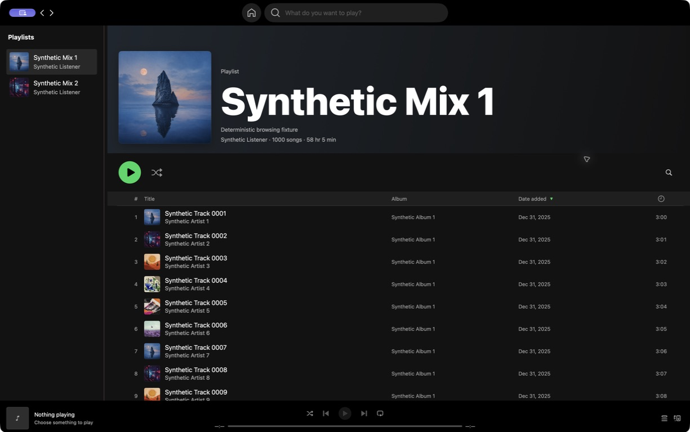

  

# Spotty

A native macOS music client for Spotify Premium, built for personal experimentation on Apple
Silicon Macs running macOS 15 or newer.

Spotty uses SwiftUI and AppKit for its interface, AVFoundation for audio output, and a pinned
Rust/librespot backend for Spotify sessions, Connect, and audio streaming and decoding. There is
no WebView or Chromium runtime.

The interface has a fixed dark appearance, a library sidebar, artwork-led media pages, dense
track tables, a queue rail, and a bottom player. Spotify's layout is a design reference, not an
indication of affiliation.

## Capabilities

- **Playback:** local 320 kbps audio, pause/resume, seeking, previous/next, gapless transitions,
  repeat, and persistent shuffle with fewer repeats.
- **Spotify Connect:** device discovery, remote playback mirroring, device transfer, and queue
  display. Add selected tracks to the queue in visible order. Remove upcoming queue entries when
  another device owns playback and permits edits; removals preserve duplicates and appear only
  after Spotify confirms them.
- **Browsing:** Home, Search, profile, Liked Songs, playlists, albums, and artists from the
  signed-in account.
- **Track details:** sortable metadata, including Date Added in playlists and Popularity, BPM,
  and Camelot Key in shared catalog tables where applicable.
- **Playlist editing:** add selected tracks to an owned library playlist or remove selected
  occurrences from an open owned playlist, with success and failure feedback.
- **macOS integration:** native navigation, tables, menus, inspector, keyboard commands, and
  accessibility. Preserve native focus and selection behavior; playback actions use Spotty green.

## Download and install

Spotty requires macOS 15 or newer, an Apple Silicon Mac, and a Spotify Premium account.
App downloads are published on [GitHub Releases](https://github.com/aladh/Spotty/releases).
Releases named `SpottyPlaybackCore` contain the playback dependency, not the Spotty app.

Download the `Spotty-<version>.zip` archive, unzip it, and drag **Spotty.app** into
**Applications**. See [archive verification](docs/development/releases.md#verify-a-download) to check the download checksum.

### First launch on macOS

Spotty is not notarized or Developer ID signed, so macOS may block the first launch. If you trust
this download, allow it through System Settings:

1. Open **Spotty** from Applications. If macOS blocks it because the developer cannot be verified
   or Apple cannot check it for malicious software, dismiss the alert without moving the app to Trash.
2. Go to **System Settings → Privacy & Security**.
3. Find the message about Spotty in the **Security** section and click **Open Anyway**.
4. Authenticate if asked, then confirm that you want to open Spotty.

After approval, open Spotty normally. Choose **Connect** and complete Spotify authorization in
your browser. See [Apple's first-open guidance](https://support.apple.com/en-us/102445) for details.

## Development

See the [documentation index](docs/README.md) for [building from source](docs/development/setup.md#fresh-clone),
product contracts, architecture, and the PR workflow.

## Privacy and security

Spotty has no analytics, advertising, crash-reporting SDK, or Spotty-operated server. It requests
account data directly from Spotify and renders it locally. OAuth credentials are stored in macOS
Keychain. Artwork loads through SwiftUI `AsyncImage` with framework-managed caching; operational logs use
Apple Unified Logging locally.

Read [PRIVACY.md](PRIVACY.md) before signing in. Report security issues through the private process
in [SECURITY.md](SECURITY.md), not a public issue.

## License

Spotty is intended for personal, non-commercial experimentation. The MIT license covers this
repository's code; it does not grant rights to Spotify's service, content, trademarks, or private
interfaces. Review Spotify's [Developer Policy](https://developer.spotify.com/policy) before
considering distribution.

Portions of the playback bridge, authentication flow, renderer, and Connect command shapes are
adapted from MIT-licensed Spotifly. The Rust backend links a pinned librespot revision and the
locked crates in `Cargo.lock`. Attribution, revisions, and dependency notices are recorded in
[NOTICE](NOTICE) and [THIRD_PARTY_NOTICES.md](THIRD_PARTY_NOTICES.md).

See [LICENSE](LICENSE) for the full license.
